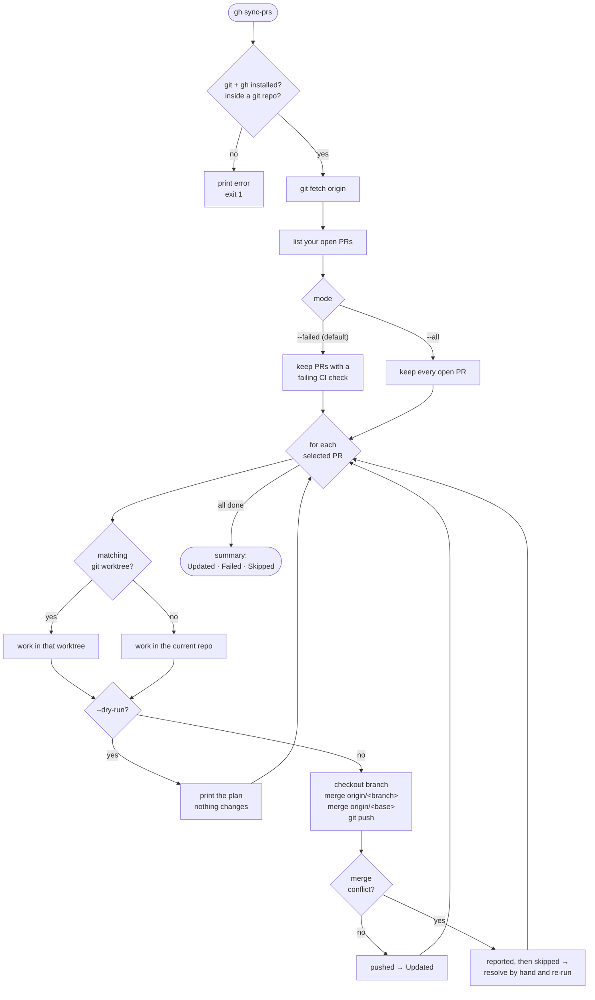
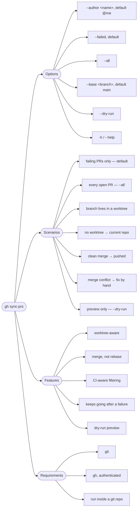

# gh-sync-prs

A [GitHub CLI](https://cli.github.com/) extension that syncs your open pull
request branches with **both** their remote branch and a base branch — and is
aware of [Git worktrees](https://git-scm.com/docs/git-worktree).

It is designed for the common case where `main` has moved on, your PR's CI has
gone red, and you just want to merge the latest changes in and re-trigger the
checks — across one or many PRs, without hunting down each branch by hand.

## What it does

`gh sync-prs` is a GitHub CLI extension. Once installed it runs as
`gh sync-prs`. For each of your open pull requests it:

1. Finds the matching Git **worktree**, if one exists (otherwise it uses the
   current repository).
2. Merges the latest `origin/<branch>` into the local branch.
3. Merges `origin/main` (or another base branch) into the local branch.
4. Pushes the result back up.

By default it only touches PRs whose CI is currently **failing**, which makes it
a fast way to bring red PRs back in line with the base branch.

## How it works



The options, features, and scenarios at a glance:



## Installation

This is a GitHub CLI extension, so you install it through `gh`:

```bash
gh extension install rodrigosf672/gh-sync-prs
```

Upgrade it later with:

```bash
gh extension upgrade sync-prs
```

## Usage

```bash
gh sync-prs
gh sync-prs --dry-run
gh sync-prs --all
gh sync-prs --author rodrigosf672
gh sync-prs --base main
```

### Options

| Option              | Description                                            | Default |
| ------------------- | ------------------------------------------------------ | ------- |
| `--author <author>` | PR author to filter by.                                | `@me`   |
| `--all`             | Sync all open PRs from the author.                     | —       |
| `--failed`          | Sync only open PRs with failing CI.                    | default |
| `--base <branch>`   | Base branch to merge into each PR branch.              | `main`  |
| `--dry-run`         | Show what would be updated, without changing anything. | off     |
| `-h`, `--help`      | Show help.                                             | —       |

## Default behavior

When run with no arguments, `gh sync-prs`:

- Finds open PRs authored by `@me`.
- Filters them down to PRs with **failing CI**.
- Finds the matching Git worktree, if one exists.
- Merges `origin/<branch>`.
- Merges `origin/main`.
- Pushes.

Use `--all` to sync every open PR from the author instead of only the failing
ones, and `--base <branch>` to merge a base branch other than `main`.

## Requirements

- [`git`](https://git-scm.com/)
- [`gh`](https://cli.github.com/) (the GitHub CLI)
- An authenticated GitHub CLI — run `gh auth login` first.

You must run the command from inside a Git repository.

## Warning

- This uses **merge commits**, not rebase. Your PR branches will gain merge
  commits from both `origin/<branch>` and the base branch.
- If a branch hits a **merge conflict**, `gh sync-prs` stops working on that PR,
  reports the path where you can resolve it manually, and continues on to the
  next PR.
- Run with `--dry-run` first to see exactly what would happen before any
  branches are changed or pushed.

## License

[MIT](LICENSE) © Rodrigo Silva Ferreira
